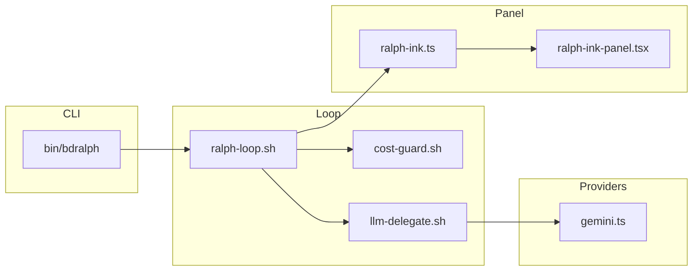
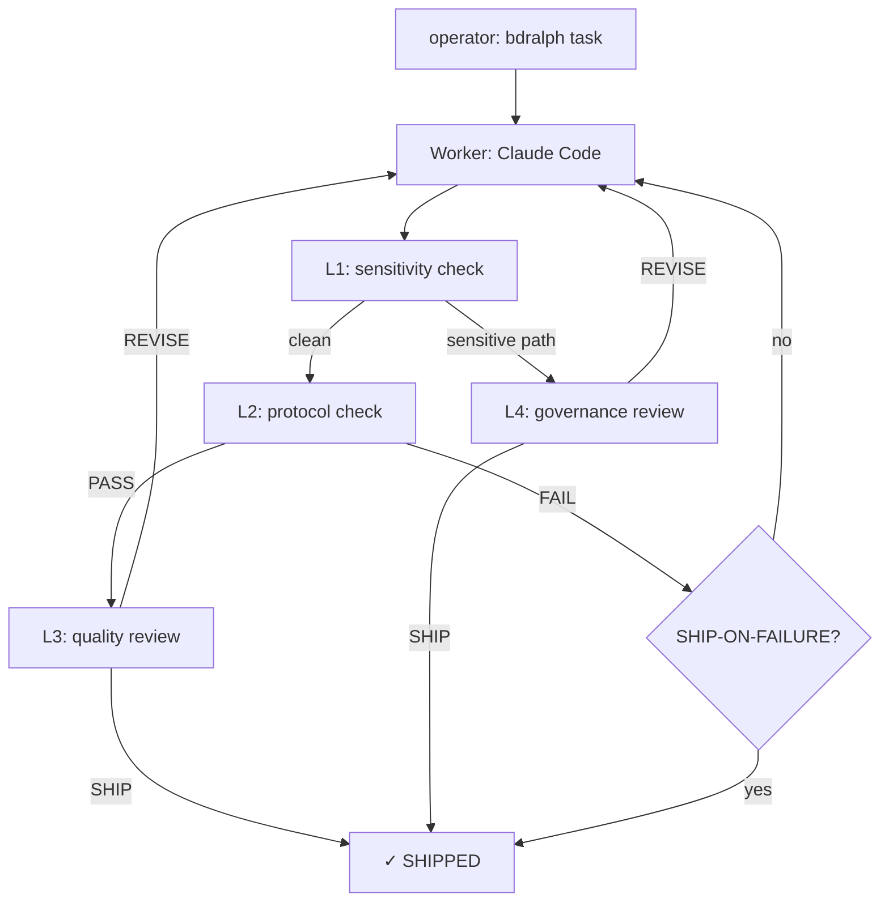
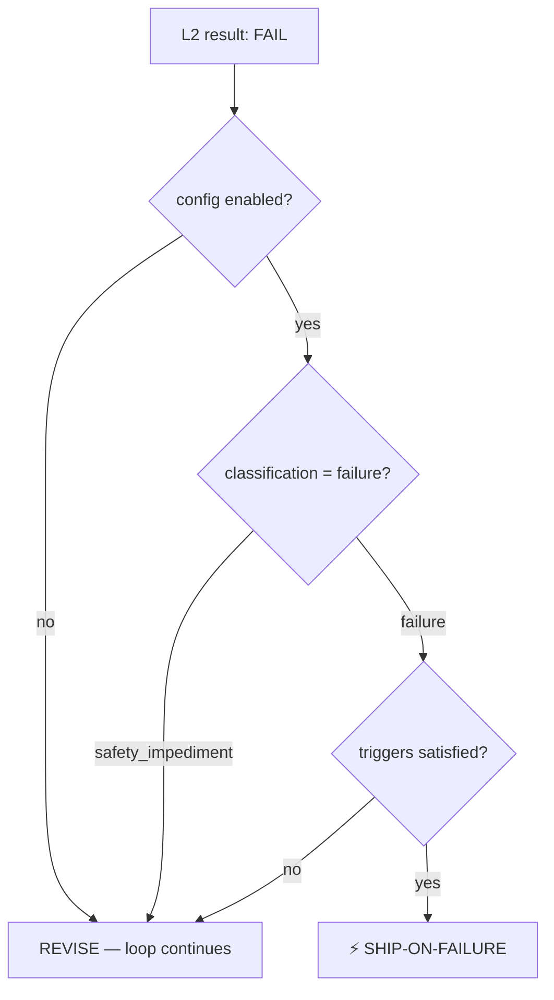
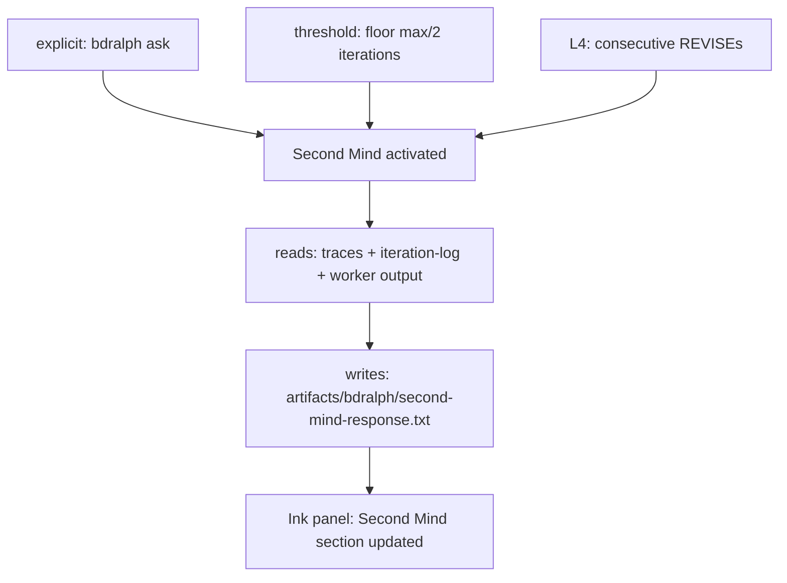

# bdralph

*Governed agentic loops for Claude Code.*

bdralph wraps Claude Code as a worker inside a structured, observable loop with a
multi-layer review pipeline (L1-L4), operator controls, cost guard, and a terminal UI.

## Contents

- [Status](#status)
- [Prerequisites](#prerequisites)
- [Install](#install)
- [Quick start](#quick-start)
- [How it works](#how-it-works)
- [CLI reference](#cli-reference)
- [Environment variables](#environment-variables)
- [SHIP-ON-FAILURE](#ship-on-failure)
- [Second Mind](#second-mind-1)
- [Providers](#providers)
- [Project structure](#project-structure)
- [Runtime output](#runtime-output)
- [Known Issues](#known-issues)
- [Documentation](#documentation)

## Status

**M1-M7 implemented. Under active stabilization.**

The core loop (`NO_UI` mode) is functional and has been validated end-to-end.
The Ink terminal panel is not usable in devcontainer environments (see Known Issues).
Stop controls, Second Mind threshold, L1 escalation, SHIP-ON-FAILURE, session cleanup, traces, and cost guard are covered by automated E2E headless tests (`npm run test:e2e:headless`).

## Prerequisites

- Node.js 22+
- Claude Code CLI (`claude --version`) - [install](https://claude.ai/install)
- An OpenAI or Google API key for the review pipeline (L2/L3/L4)

## Install

```bash
git clone https://github.com/paulo-raoni/bdralph
cd bdralph
npm install
npm link   # makes `bdralph` available in PATH
```

## Quick start

```bash
# Web UI dashboard (recommended — works everywhere, including devcontainer)
bdralph "Add input validation to UserService" --max 5 --web-ui

# Headless mode (no UI, plain text output)
BDRALPH_NO_UI=1 bdralph "Add input validation to UserService" --max 5

# With Ink panel (requires a real TTY — does not work in devcontainer)
bdralph "Add input validation to UserService" --max 5
```

## How it works

bdralph runs Claude Code iteratively inside a governed loop. Each iteration:

1. **Worker** - Claude Code executes the task
2. **L1** - Bash sensitivity check (zero cost, no LLM)
3. **L2** - Protocol review via cheap LLM (OpenAI or Gemini)
4. **L3** - Quality review via standard LLM
5. **L4** - Governance review (triggered by L1 escalation or repeated L3 REVISEs)

The loop continues until the pipeline emits SHIP, the budget is exhausted, or max
iterations are reached.

### Component map



### Pipeline flow



## CLI reference

```bash
bdralph <task|task-file> [options]
```

| Flag | Default | Description |
|---|---|---|
| `--max N` | 10 | Maximum iterations |
| `--budget USD` | 0.50 | Reviewer cost ceiling in USD |
| `--worker sonnet\|opus\|auto` | sonnet | Worker model |
| `--escalate-after N` | 3 | Consecutive REVISEs before L4 escalation |
| `--reviewer-mode pipeline\|single` | pipeline | Review strategy |
| `--web-ui` | - | Enable web UI dashboard at `http://localhost:7340` |

### Stop controls

Send signals to a running loop from a second terminal:

```bash
bdralph stop --now          # stop immediately
bdralph stop --after-this   # finish current iteration then stop
bdralph stop --on-fail      # stop if next iteration fails
```

### Second Mind

Ask a question to the loop's context-aware advisor:

```bash
bdralph ask "Why does the loop keep getting REVISE on the auth module?"
```

Second Mind also activates automatically at `floor(max/2)` iterations without SHIP,
and when L4 emits consecutive REVISEs.

## Environment variables

### Runtime

| Variable | Default | Description |
|---|---|---|
| `BDRALPH_NO_UI` | - | Set to `1` to disable all UI (use in CI) |
| `BDRALPH_WEB_UI` | - | Set to `1` to enable web UI dashboard |
| `BDRALPH_WEB_PORT` | `7340` | Web UI server port |
| `BDRALPH_BUDGET` | `0.50` | Session budget in USD |
| `BDRALPH_TRACE_HISTORY` | `3` | L4 traces injected into worker prompt per iteration |

### Provider chain

| Variable | Default | Description |
|---|---|---|
| `BDRALPH_L2_PROVIDER_CHAIN` | `openai-cheap gemini-flash` | Space-separated L2 provider chain |
| `BDRALPH_L3_PROVIDER_CHAIN` | `openai-standard gemini-flash openai-mini` | Space-separated L3 provider chain |
| `BDRALPH_PROVIDER_FAILOVER` | `notify` | `notify` or `pause` on provider failover |

### Gemini SDK (M7)

```bash
BDRALPH_GEMINI_MODEL=gemini-2.5-flash \
BDRALPH_L2_PROVIDER_CHAIN="gemini-sdk" \
bdralph "task"
```

| Variable | Description |
|---|---|
| `BDRALPH_GEMINI_MODEL` | Gemini model to use (default: gemini-2.5-flash) |
| `BDRALPH_GEMINI_INPUT_PRICE` | USD per input token |
| `BDRALPH_GEMINI_OUTPUT_PRICE` | USD per output token |

## SHIP-ON-FAILURE

Opt-in feature that allows the loop to SHIP even when the worker reports a failure,
if configured triggers are satisfied. Configure in `.bdralph.config.json`:

```json
{
  "ship_on_failure": {
    "enabled": true,
    "triggers": [
      "all tests pass",
      "no regression introduced"
    ]
  }
}
```

Triggers are evaluated semantically by L2 - not by keyword matching.
SHIP-ON-FAILURE never fires on `safety_impediment` classifications.



## Second Mind

Second Mind is a context-aware advisor that runs alongside the loop. It has access to
the full session context - L1-L4 traces, iteration log, and worker output - and can
answer operator questions or surface insights when the loop is stuck.

### Activation triggers

| Trigger | Condition |
|---|---|
| Explicit | Operator runs `bdralph ask "question"` in a second terminal |
| Threshold | Loop reaches `floor(max/2)` iterations without SHIP |
| L4 signal | L4 emits REVISE `--escalate-after` consecutive times |

### Flow



### Limitations

- `bdralph ask` without an active loop writes the signal silently - no error or warning
- Second Mind response is visible in the Ink panel only (not printed in NO_UI mode)

## Providers

The review pipeline (L2/L3/L4) supports:

| Provider name | Model | API |
|---|---|---|
| `openai-cheap` | gpt-5.4-nano | OpenAI |
| `openai-standard` | gpt-5.4-mini | OpenAI |
| `openai-mini` | gpt-4o-mini | OpenAI |
| `gemini-flash` | gemini-2.5-flash | Google (curl) |
| `gemini-sdk` | gemini-2.5-flash | Google (@google/generative-ai SDK) |

Required env vars: `OPENAI_API_KEY` and/or `GOOGLE_API_KEY`.

## Project structure

```
bin/
  bdralph                    <- CLI entry point (flag parsing, validation, dispatch)

src/
  loop/
    ralph-loop.sh            <- main loop orchestrator
    llm-delegate.sh          <- delegates review prompts to LLM providers
    cost-guard.sh            <- budget enforcement library
    ink/
      ralph-ink.ts           <- Ink panel entry point (spawned by loop)
      ralph-ink-panel.tsx    <- React/Ink terminal UI component
      ralph-ink-helpers.ts   <- pure helper functions (testable)
    providers/
      gemini.ts              <- native Gemini SDK provider
  web/
    server.ts                <- HTTP + SSE server for web UI dashboard
    state.ts                 <- pure functions: read state files → DashboardState
    dashboard.html           <- single-file browser dashboard (CSS + JS inline)

docs/
  architecture.md            <- component map and design
  loop.md                    <- loop scripts, env vars, state files
  traces.md                  <- trace system and output schema
  DECISIONS.md               <- index of key design decisions
  PROGRESS.md                <- milestone history
  BACKLOG.md                 <- future ideas and deferred scope
  decisions/
    M0.md ... M7.md          <- per-milestone decision records

tests/
  cli/                       <- CLI entry point tests
  loop/                      <- loop script tests (mock delegate)
  panel/                     <- Ink panel tests (node-pty)
  providers/                 <- Gemini SDK tests
  e2e/
    loop/                    <- E2E Nível 1: headless mock loop tests (10 tests)
    helpers/                 <- shared helpers: loop-runner, signal-writer, file-waiter, trace-reader
    roteiros/                <- manual E2E roteiros (not automated)
    EDGE_CASES.md            <- known gaps and edge cases
  fixtures/
    mock-bin/                <- fast mock worker + mock git
    mock-bin-slow/           <- slow mock worker (for stop-control timing tests)
    mock-delegate/           <- mock LLM delegate (fixed response + sequence)

artifacts/bdralph/           <- runtime state (gitignored)
logs/                        <- runtime logs (gitignored)
```

## Runtime output

bdralph writes structured output to `artifacts/bdralph/` during execution.

| File | Description |
|---|---|
| `task.md` | The task passed to the loop |
| `iteration.txt` | Current iteration number |
| `review-result.txt` | Last review result (SHIP / REVISE / BLOCKED) |
| `review-feedback.txt` | Last review feedback text |
| `iteration-log.json` | Worker's strategy and rationale for the current iteration |
| `work-summary.txt` | Appended after each iteration: number, model, outcome, cost |
| `work-complete.txt` | Written on loop exit: final status, iterations, cost, timestamp |
| `second-mind-response.txt` | Second Mind response (overwritten on each activation) |
| `traces/lN-iteration-N.json` | Per-layer trace (L1-L4) for each iteration |

All files in `artifacts/` are gitignored and cleaned at session start.

## Known Issues

### Ink panel not usable in devcontainer

TTY (teletypewriter) is the device that connects a process to an interactive terminal display. The Ink panel needs direct access to `/dev/tty` to render its interface with positioned cursor, colors, and real-time updates.

In devcontainer environments, `/dev/tty` exists in the filesystem but is not actually connected to a terminal (the underlying device returns ENXIO — "No such device or address" — when opened). The Ink process crashes immediately on startup.

**Solution:** use the web UI dashboard (`--web-ui`), which works everywhere:

```bash
bdralph "your task" --max 5 --web-ui
```

The web UI provides a full dashboard at `http://localhost:7340` with live SSE updates, pipeline visualization, worker output, stop controls, and Second Mind — no TTY required.

**Alternative:** use `BDRALPH_NO_UI=1` for plain text output (no dashboard).

### Worker iterations are slow

Each worker iteration invokes Claude Code (`claude -p`), which has significant startup
overhead. Simple tasks can take 2-6 minutes per iteration. There is no way to speed
this up - it is a function of the Claude Code CLI.

In `NO_UI` mode, the only feedback during a worker iteration is `Working...`.
The Ink panel would provide real-time worker output, but is blocked by the devcontainer
issue above.

### `bdralph ask` does not warn when no loop is active

Running `bdralph ask "question"` when no loop is running writes the signal file
silently. The operator receives no indication that the message was not delivered.

### Second Mind threshold with small --max

Second Mind activates automatically at `floor(max/2)` iterations. With `--max 3`,
it activates at iteration 1 - on every run. This is by design but may feel aggressive
for short tasks.

## Documentation

- [docs/architecture.md](docs/architecture.md) - component map and data flow
- [docs/loop.md](docs/loop.md) - loop scripts, env vars, state files
- [docs/traces.md](docs/traces.md) - trace system and output schema
- [docs/DECISIONS.md](docs/DECISIONS.md) - index of key design decisions
- [docs/PROGRESS.md](docs/PROGRESS.md) - milestone history
- [docs/BACKLOG.md](docs/BACKLOG.md) - future ideas and deferred scope
